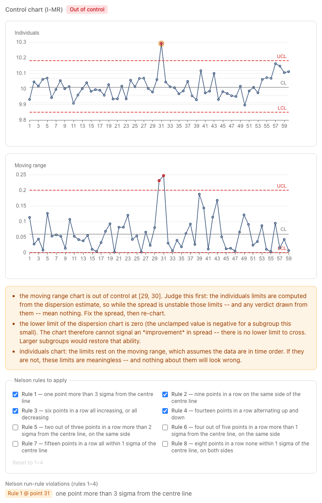
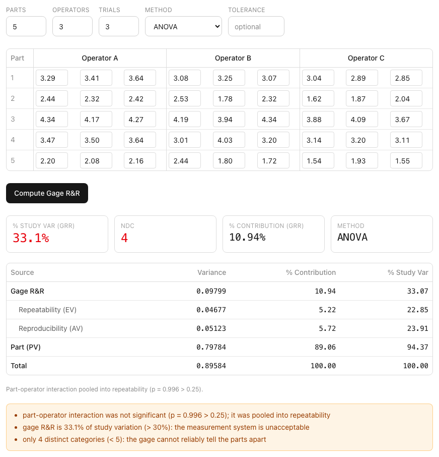

# capstat

[](https://github.com/Xindaan/capstat/actions/workflows/ci.yml)
[](LICENSE)
[](https://www.python.org/downloads/)

**Reference-validated statistical process control, process capability, and
measurement system analysis — correctness you can audit.**

capstat is a trustworthy, MIT-licensed alternative to expensive
quality-engineering software. Its differentiator is verifiable correctness:
every statistical result is validated against published reference values
(NIST StRD, Montgomery, AIAG manuals, ISO 22514).

> **Status:** v0.2.0. All three pieces are built and tested — the statistics
> library, the HTTP API, and the web app (capability, control charts, Gage R&R,
> bias/linearity/stability, acceptance sampling). The core library is on PyPI as
> [`capstat-core`](https://pypi.org/project/capstat-core/); the API and web app
> run from the checkout. There is **no hosted demo, by design**: you run it on your own
> machine, and your measurements never leave it. See [TASK.md](TASK.md) for
> what is next.


<sup>Every figure in this README is produced by the real library from
[`examples/shaft-diameter.csv`](examples/shaft-diameter.csv) — see
[Screenshots](#screenshots).</sup>

## Quickstart

Requires [uv](https://docs.astral.sh/uv/) (Python 3.11+ is fetched
automatically).

```bash
git clone https://github.com/Xindaan/capstat.git
cd capstat
uv sync                 # create the environment and install all workspace members
uv run pytest           # run the test suite
```

The statistics library is also usable on its own, without the API or the web
app. It depends on nothing but numpy and scipy:

```bash
pip install capstat-core        # or: uv pip install capstat-core
```

To track unreleased changes instead, install it from a checkout:

```bash
uv pip install ./packages/capstat-core
```

## Usage

The sections below walk the library from descriptive statistics through
normality, capability, control charts, run rules, Gage R&R and acceptance
sampling. Starting with the descriptive and robust (outlier-resistant)
estimators:

```python
from capstat_core import describe, mad, median, trimmed_mean

measurements = [10.1, 10.3, 9.8, 10.0, 10.2, 9.9, 10.4, 25.0]  # one bad reading

summary = describe(measurements)
summary.mean        # 11.9625   -- dragged up by the one bad reading
summary.std_dev     # 5.2717    -- and so is the spread
summary.skewness    # skewness / kurtosis for a normality gut-check
summary.lag1_autocorrelation  # serial correlation: are the data independent?

# Robust alternatives, which the outlier barely moves:
median(measurements)              # ~10.15
trimmed_mean(measurements, 0.125) # 10.15
mad(measurements)                 # ~0.2965 -- a sigma estimate, scaled for
                                  # normal data, vs. std_dev's 5.2717
```

`describe` returns an immutable `DescriptiveSummary` with `n`, `mean`,
`variance`, `std_dev`, `minimum`, `maximum`, `range`, `median`, `q1`, `q3`,
`iqr`, `skewness`, `kurtosis`, and `lag1_autocorrelation`.

### Normality — with the caveats attached

Capability indices assume a normal process. `assess_normality` runs both the
Anderson-Darling and Shapiro-Wilk tests and returns a verdict you can act on,
together with every reason that verdict might mislead you:

```python
from capstat_core import assess_normality

report = assess_normality(measurements)

report.normal            # False -- True only if BOTH tests fail to reject
report.recommendation    # what to do next, in words
report.warnings          # why the verdict might be wrong; () means "take it at face value"
```

On the NIST `Mavro` dataset (50 filter-transmittance readings) it reports
non-normality (Anderson-Darling p = 2.4e-04, Shapiro-Wilk p = 5.1e-04) — and
also warns that the lag-1 autocorrelation is **0.938**, which violates the
independence assumption *both tests are built on*. A tool that printed only the
p-value would be confidently reporting a number it had no right to compute.
`assess_normality` also flags samples too small to have power, samples so large
that trivial deviations turn "significant", and cases where the two tests
disagree (which fail closed, as non-normal).

### Capability — Cpk and Ppk, never one without the other

```python
from capstat_core import capability

report = capability(subgroups, lsl=90.0, usl=110.0, target=100.0)
```

On a process whose mean drifts between subgroups, capstat reports:

| | potential (short-term) | actual (long-term) |
|---|---|---|
| spread | Cp = 3.61 | Pp = 1.26 |
| centred | **Cpk = 3.25** | **Ppk = 1.13** |

Same data. `Cpk = 3.25` looks world-class; `Ppk = 1.13` is what the customer
actually receives. The gap *is* the instability — `sigma_overall` is 2.87× the
within-subgroup sigma — and capstat says so in `report.warnings` rather than
letting you quote the flattering number.

Cp/Cpk need subgroup structure to mean anything. Given a flat list of
measurements, capstat estimates the short-term sigma from the moving range and
tells you it did, instead of quietly substituting the overall sigma and still
calling the result Cpk. Given no `target`, it returns `cpm = None` rather than
assuming your target is the midpoint of the tolerance — for an asymmetric
tolerance, that assumption is simply wrong.

### Non-normal processes — a decision path, not a silent assumption

Plenty of real processes are legitimately skewed (anything bounded at zero:
flatness, roundness, contamination). On those, the standard indices are not
merely imprecise — they are wrong, and usually optimistic. `analyze_capability`
picks a method and **records why**:

```python
from capstat_core import analyze_capability

analysis = analyze_capability(measurements, lsl=5.0, usl=60.0)

analysis.path       # "normal" | "box-cox" | "percentile"
analysis.rationale  # the reasoning, in words
analysis.ppk
```

On a lognormal process it reports:

> path: `box-cox` — *"the normal model was rejected, but a Box-Cox
> transformation with lambda = 0.0525 achieved normality, so the standard
> indices were computed on the transformed scale against the transformed
> specification limits. Box-Cox is preferred over the percentile method because
> it preserves the within/overall split, and hence Cp and Cpk."*

Note **"against the transformed specification limits"**. Transforming the data
and leaving the limits in their original units is the classic way to produce a
confidently wrong Cpk; capstat carries the limits through the same λ (here
LSL 5.0 → 1.6794, USL 60.0 → 4.5677). Box-Cox is skipped, with an explanation,
when the data are not strictly positive — capstat will not shift your data to
make the maths work, because the offset changes the indices and must be your
recorded decision.

If Box-Cox cannot achieve normality either, the path falls through to the
**ISO 22514 percentile method**, which replaces the 6σ span with the span
between the 0.135 % and 99.865 % percentiles of a fitted distribution. That
method yields long-term indices only — it has no within/between split, so no Cp
or Cpk exists for it, and capstat does not invent one.

> **The two non-normal methods are not interchangeable.** They agree only where
> a process is exactly "just capable" (index = 1); elsewhere they legitimately
> differ — we measure Box-Cox Ppu = 1.61 against percentile Ppu = 2.44 on
> identical data. Don't compare an index from one against a threshold
> calibrated on the other.

### Control charts — read the dispersion chart first

```python
from capstat_core import xbar_r_chart, xbar_s_chart, i_mr_chart

pair = xbar_r_chart(subgroups)

pair.location.violations     # X-bar chart: []      — every average in limits
pair.dispersion.violations   # R chart:     [9]     — the spread is not
pair.in_control              # False
```

The X-bar chart above looks perfectly healthy. It isn't. Its limits are computed
*from* R̄ — so when the R chart is out of control, R̄ is an average of
incomparable things and the X-bar limits derived from it mean nothing. capstat
judges the dispersion chart first and says so:

> *"the R chart is out of control at [9]. Judge this first: the X-bar limits are
> computed from the dispersion estimate, so while the spread is unstable those
> limits — and any verdict drawn from them — mean nothing. Fix the spread, then
> re-chart."*

`in_control` is the AND of both charts, never just the location chart.

Other things capstat tells you rather than leaving you to know:

- **The R/s chart has no lower limit for small subgroups** (D₃ = 0 for n ≤ 6).
  That is not a rounding convention — the unclamped limit is negative, and a
  range cannot be. The consequence is that the chart *cannot detect an
  improvement* in spread, and capstat says so.
- **`i_mr_chart` assumes your data are in time order.** Shuffle them and the
  limits still look perfectly reasonable. capstat cannot detect that, so it
  warns every time.
- **These are Phase I (trial) limits**, estimated from the data being plotted.
  A large excursion inflates the very limits meant to catch it.

Run-based rules (Nelson, Western Electric) that catch drifts never crossing a
limit are not in yet — only points beyond the limits are flagged today.

All chart constants (d₂, d₃, c₄, A₂, A₃, B₃, B₄, D₃, D₄, E₂) are **computed from
their definitions**, not copied from a table. That is not fussiness: the
published tables print `E₂ = 2.660`, which is wrong — they evaluated `3/d₂` using
an already-rounded `d₂ = 1.128` and propagated the error. The true value is
2.6587. (The tables also disagree with each other: NIST prints D₄(3) = 2.575,
the ASTM-derived table 2.574. We compute 2.5746.)

### EWMA and CUSUM — seeing what Shewhart misses

A Shewhart chart looks at one point at a time, which makes it excellent at
catching a big jump and nearly blind to a small sustained drift. Give a process
a **+1σ shift at point 30** and watch:

```python
from capstat_core import i_mr_chart, cusum_chart

i_mr_chart(values).location.violations   # ()  — never notices, across 70 points
cusum_chart(values, target=100, sigma=1).violations[0]   # 46 — found it
```

The Shewhart chart never signals at all. CUSUM finds the shift 16 points in.
That is the whole reason these charts exist: a 3σ Shewhart chart takes ~44
points on average to see a 1σ shift, a CUSUM about 10 — both figures verified by
simulation in the test suite, not quoted on faith.

**The trap capstat defaults around:** both charts need a σ, and the obvious
choice — the standard deviation of all the data — is poison. A sustained shift
*inflates* that σ, which widens the limits, which hides the shift. The chart then
reports that everything is fine. capstat estimates σ from the **moving range**
instead, which only sees consecutive differences and so survives a level change
almost intact (measured over 200 runs: moving-range σ = 1.002 where the overall
standard deviation is inflated to 1.406). It tells you it did that, and tells you
that a σ from a known stable period would be better still.

EWMA limits are **time-varying** by default, because the variance of the EWMA
statistic grows with i. Using the steady-state width everywhere — as the NIST
e-Handbook example does — makes the first limit **40 % too wide**, so a shift
present at the start of the series can slip underneath it. Pass
`time_varying_limits=False` to reproduce published tables.

### Run rules — Nelson and Western Electric

A point outside the limits is the only signal a bare Shewhart chart gives, and
it is rarely the one a real process offers first. Processes drift, trend, and hug
the centre line long before they throw a point past 3σ.

```python
from capstat_core import xbar_r_chart, nelson_rules, western_electric_rules

pair = xbar_r_chart(subgroups)
for v in nelson_rules(pair.location):
    print(v.point, v.rule, v.description)
    # 4  rule 6: four out of five points in a row more than 1 sigma
    #            from the centre line, on the same side
```

Rules are applied **to** a chart, not baked into it — the zones are derived from
the chart's own limits. So `ControlChart.violations` keeps meaning exactly what
it always meant (points beyond the limits, which *is* Nelson rule 1), and nothing
gets reported twice under two names. Each `RuleViolation` carries the point that
completed the pattern *and* the whole window, so a plot can highlight the run and
not just its last point.

A `k`-of-`m` rule (Nelson 5 and 6, Western Electric 2 and 3) fires on the point
that **completes** the pattern, including when that point falls at the very start
of a series — a process already out of control when the chart begins signals on
its second or fourth point rather than not at all.

**The two standards disagree, and that is useful.** Western Electric rule 4 fires
on **eight** consecutive points on one side; Nelson's rule 2 needs **nine**. A run
of exactly eight fires one and not the other — which is exactly the sequence that
would expose an off-by-one in either implementation, and capstat tests it.

> **Switching on more rules is not free.** On a perfectly stable process the 3σ
> test alone signals about once in 370 points. All four Western Electric rules:
> once in 61. All eight Nelson rules: **once in 44** — roughly *eight times*
> jumpier. Nelson himself advised against running all eight at once. Pass a
> subset (`nelson_rules(chart, [1, 2, 3])`) and pick the rules that match the
> failure you're actually hunting. (These rates are simulated in the test suite,
> not quoted from a textbook.)

**On accuracy.** The variance and every other centered moment use a two-pass
algorithm. This is not pedantry: on the NIST `NumAcc4` dataset the textbook
one-pass formula returns a *negative* variance. capstat reproduces the NIST
certified values to the limit of double precision — see
[the reference suite](packages/capstat-core/tests/references/) for the sources,
the certified numbers, and a written justification for every tolerance.

### Gage R&R — how much of the spread is the gage, not the parts

Before you trust a measurement, find out how much of the variation you are
seeing is the measurement system itself. `gage_rr` runs the crossed ANOVA
method (parts × operators × trials) and partitions the variance into
repeatability, reproducibility, and the real part-to-part spread.

```python
import numpy as np
from capstat_core import gage_rr

# data[part, operator, trial]
report = gage_rr(measurements)
print(report.verdict)                 # "unacceptable"
print(report.pct_study_var_gage_rr)   # 33.1  -> the number behind it
print(report.ndc, report.ndc_adequate)  # 4 False -> can't tell parts apart
for w in report.warnings:
    print(w)
```

**The AIAG band is stated, not left to be re-derived.** `verdict` is
`"good"` / `"marginal"` / `"unacceptable"`, and `ndc_adequate` says whether the
gage separates the parts; the boundaries live in `GRR_GOOD_AT_OR_BELOW`,
`GRR_MARGINAL_AT_OR_BELOW` and `NDC_MINIMUM`. That matters because the same
judgement is also printed in `warnings` and coloured in the web app — three
places that must never disagree, and they used to hold three copies of the
thresholds. Both are `None` when there is nothing to judge (a gage with no
variance of its own), which is deliberately **not** the same as `"good"`.

Two things that quietly bias other tools are handled explicitly. When the
part-by-operator **interaction is not significant** (AIAG's generous
`p > 0.25`), it is dropped and pooled back into repeatability before the
components are re-estimated — keeping a phantom interaction inflates
reproducibility and hides a good gage. And when a variance estimate comes out
**negative** (mean-square differences can, for a component near zero), it is
clamped to zero and reported honestly as "indistinguishable from zero", with a
warning, rather than printed as a negative variance. %Contribution, %Study
Variation, and the number of distinct categories all fall out of the same
components.

The older **average-and-range** method is available too (`gage_rr_range`), for
comparison or hand-calculation parity. It estimates each standard deviation from
a range and a bias-correction constant — including `d2_star(n, g)`, the
finite-sample d2 that the AIAG K2/K3 tables encode. capstat computes it from its
own `d2`/`d3` as `sqrt(d2² + d3²/g)` rather than copying the table, and checks it
against the published values. On the same data the two methods agree closely.

### Bias, linearity, stability — is the gage *right*?

Gage R&R asks whether a measurement system is consistent. These three ask
whether it is correct, and they need something Gage R&R does not: a part whose
true value you already know.

```python
from capstat_core import bias, linearity, stability

bias(readings, reference=36.0)          # is the average off the master?
linearity(references, measurements)     # does the bias drift across the range?
stability(readings_over_time)           # does the gage hold still over weeks?
```

**Bias** is a one-sample t-test of repeated readings against the reference. The
verdict is interval-based — "does the confidence interval for the bias straddle
zero" — which still answers the question when every reading is identical and the
t-statistic is not defined.

**Linearity** regresses the bias of every reading on the reference value across
several masters. A significant slope means the bias *changes* with the measured
value: the gage stretches the scale, and a single bias correction will not fix
it. Reports AIAG's `%linearity = |slope| × 100`.

**Stability** is a control chart on a master part, and capstat says so rather
than dressing it up: an out-of-control point means the gage drifted, because the
part's true value never moved.

### Acceptance sampling — deciding a lot, and what that decision is worth

A single sampling plan by attributes is two numbers: draw `n` items, accept the
lot if at most `Ac` are defective. capstat computes the consequences of those two
numbers from the definition rather than reading plans out of a standard's table.

```python
from capstat_core import design_single_sampling_plan, evaluate_plan, inspect_lot

plan = design_single_sampling_plan(aql=0.01, ltpd=0.05,       # smallest (n, Ac)
                                   producer_risk=0.02,        # meeting both
                                   consumer_risk=0.15)        # risk points
plan.sample_size, plan.acceptance_number      # (144, 4)

report = evaluate_plan(plan, aql=0.01, ltpd=0.05)
report.producer_risk, report.consumer_risk    # what the plan actually achieves
report.indifference_quality                   # where it is a coin flip

inspect_lot(plan, defectives=3).accepted      # True — the decision itself
```

The operating characteristic curve comes in all three models — binomial (Type B,
a process or a large lot), hypergeometric (Type A, one finite lot), and the
Poisson approximation, which is offered explicitly and never applied silently.
Under rectifying inspection you also get AOQ, the AOQL (found by searching the
curve, not read off a grid) and ATI.

What the reports insist on saying: a sampling plan bounds risk over a **stream**
of lots and asserts almost nothing about the one in front of you; an `Ac = 0`
plan rejects good lots far more often than its sample size suggests; and the
AOQL is an average, not a bound on any single outgoing lot.

The AQL master tables of ISO 2859-1 and its relatives are deliberately *not*
implemented — those are committee conventions rather than derived values, and
reproducing them is a licensing question first. If a specification prescribes a
plan, read `n` and `Ac` from your own copy of the standard and hand them to
`evaluate_plan`: capstat then reports what the table does not — the risk each
side actually carries, the AOQL, and the inspection it costs. The standard says
*which* plan; capstat says *what it buys*.

## HTTP API

`apps/api` is a stateless FastAPI service that exposes every core statistic
over HTTP and adds CSV/XLSX ingestion. The core stays web-free (numpy + scipy);
pandas/openpyxl live only in the API package.

```bash
uv run uvicorn capstat_api.main:app --reload   # http://127.0.0.1:8000/docs
```

```bash
curl -s http://127.0.0.1:8000/compute/capability \
  -H 'content-type: application/json' \
  -d '{"data": [10.1, 9.9, 10.0, 10.2, 9.8, 10.05], "lsl": 9.5, "usl": 10.5}'
```

Every response mirrors a core dataclass faithfully — the `warnings` arrays and
the nullable capability indices survive serialisation rather than being
flattened away. Endpoints: `/compute/descriptive`, `/compute/capability`,
`/compute/capability/analyze`, `/compute/control-chart/{i-mr,xbar-r,xbar-s,ewma,cusum}`,
`/compute/rules/{nelson,western-electric}`, `/compute/gage-rr`,
`/compute/{bias,linearity,stability}`,
`/compute/acceptance-sampling/{evaluate,design,oc-curve,inspect,switching-rules}`,
and `/ingest` for files.

The OpenAPI schema at `apps/api/openapi.json` is the single source of truth for
the generated TypeScript client (added with the web app) and is checked for
drift in CI:

```bash
uv run python -m capstat_api.export_openapi           # regenerate
uv run python -m capstat_api.export_openapi --check    # fail on drift
```

## Web app

`apps/web` is a Next.js (App Router) front end that talks to the API through a
typed client generated from the same OpenAPI schema. Upload a CSV/XLSX, pick a
numeric column, and get a capability report (with the normal / Box-Cox /
percentile decision path and a spec-limit histogram) plus I-MR control charts
with Nelson run-rule flags. A separate `/gage-rr` page runs a full Gage R&R
study from a data-entry grid (both the ANOVA and average-and-range methods), and
`/msa` runs the bias, linearity and stability studies — each pre-filled with a
worked example. `/acceptance-sampling` designs a lot-acceptance plan from your
two risk points, draws its OC curve with both quality levels on it, decides a
lot from an observed defect count, and runs a series of lots through
ISO 2859-1's switching rules.

Every hand-entered page — `/gage-rr`, `/msa` and `/acceptance-sampling` — can
**save a study to a file and load it back**: a file on your own disk, written
and read by the browser, with nothing uploaded. Only your inputs are stored,
never the results. The numbers are recomputed from the validated core on load,
so a saved study can never show figures this version of capstat would not
produce, and a file from a newer capstat is refused with a message saying so
rather than half-read. A hand-edited file whose fields are the wrong shape is
refused the same way, naming the field (`"grid.0.0.1" should be text`): a study
restored from half a file would look exactly like a whole one. A field the file
simply *lacks* is still fine — that is how a study written before a section
existed still loads. `/` has no such button on purpose: its input is a CSV,
and re-uploading the file beats restoring it from JSON.

Every analysis page is also its own report: **Print / save as PDF** drops the
navigation and the controls, keeps the results, and prints the charts as vector
(ECharts renders SVG, not canvas), so a study goes to a PDF that still looks
right at any zoom.

Charts carry an accessible name describing what they show — "Individuals chart,
30 points, out of control at points 31, 44" — built from the same values the
chart draws, so the sentence cannot describe a different picture. Text that
carries meaning meets WCAG 2.1 AA contrast in both light and dark themes; the
`--muted` token in `app/globals.css` records its measured ratio, and a test
recomputes it rather than trusting the comment.

Run it against a local API:

```bash
uv run uvicorn capstat_api.main:app          # terminal 1: the API on :8000
cd apps/web && npm install && npm run dev     # terminal 2: the app on :3000
```

Then open <http://localhost:3000>. The client's API base URL defaults to
`http://127.0.0.1:8000`; override it at build time with `NEXT_PUBLIC_API_URL`.

`examples/shaft-diameter.csv` is a synthetic dataset to drop into the upload
page: 60 shaft diameters in time order (spec 9.70 / 10.30 mm) from a process
that drifts, with one excursion, a text column that gets ignored and two missing
cells. It is built to make the app *say* something rather than to look tidy. The
control chart signals at part 31, and the capability decision path refuses the
normal model — the drift breaks normality — and lands on the ISO 22514
percentile method, reporting **Pp 1.379 / Ppk 0.942**.

Cp and Cpk come out blank there, and that is the point: the percentile method
reads percentiles off the overall fitted distribution and has no within/between
subgroup split, so those two indices *do not exist* on that path. Software that
printed a Cpk anyway would be inventing one. (Call `capability()` directly on
this data and it will happily return Cpk 1.77 — along with a warning that the
normal model was rejected and the number is therefore wrong.)

```bash
npm run test        # vitest unit tests (pure binning / stats)
npm run test:e2e    # Playwright smoke test (API mocked, no backend needed)
npm run build       # production build + type-check
```

### Screenshots

The control chart on the same data. The process drifts and excursions at part
31, so this is deliberately not a picture of a well-behaved process — the
dispersion chart is out of control first, and the panel says to fix that before
reading anything into the individuals limits. Which of the eight Nelson rules
are applied is yours to choose; the default is 1–4, and the report always names
the set it used, because "no violations" says nothing without it.



A Gage R&R study, pre-filled with the AIAG worked example. The verdict is not
flattering and is not meant to be: 33.1 % study variation and 4 distinct
categories both fail their thresholds, and the panel says so in words.



And the guard that matters most in practice. A spreadsheet's first column is
usually a row number; it is valid numeric data, so nothing downstream would
object to computing capability from it. capstat skips it when choosing a column
and says why if you pick it anyway.


An acceptance-sampling plan designed from two risk points, not read out of a
standard's table. The OC curve carries both quality levels, because how steeply
a plan falls between them is the whole comparison — and the report ends by
saying what the AOQL does not bound.


And the switching rules, which are what make ISO 2859-1 a *scheme* rather than a
plan. A series of lots, the severity each one was inspected under, and the
switch that severity caused — a plan applied forever, with no switching, does
not give the protection the standard describes.


These are captured by a script, not by hand, so they cannot quietly go stale
against a changed UI:

```bash
cd apps/web && npm run screenshots
```

It starts the real API and the app — not the mocked stack the e2e suite uses —
drives the demo CSV through them, and rewrites `docs/images/`. Re-run it after
any UI change. A README that shows invented numbers would undercut the one
thing this project claims, so nothing here is a mockup.

## Running it with Docker

```bash
docker compose up --build     # web on :3000, API on :8000
```

Both images run as a non-root user, and the API is stateless — no database, no
secrets, no volume. Uploads are parsed in memory and never written to disk.
Deployment options (including why the API belongs on a container host rather
than serverless) are in [docs/deployment.md](docs/deployment.md).

## Configuration

capstat-core is configuration-free. The API is stateless and needs no
configuration to run. One optional knob exists for the browser client:

- **`CAPSTAT_CORS_ORIGINS`** — comma-separated list of allowed browser origins
  (default `http://localhost:3000,http://127.0.0.1:3000`, the Next.js dev
  server). Set it to your web app's origin when deploying elsewhere.

The client's API base URL is set at build time via `NEXT_PUBLIC_API_URL`
(default `http://127.0.0.1:8000`).

## Troubleshooting

- **`uv: command not found`** — install uv per the
  [official instructions](https://docs.astral.sh/uv/getting-started/installation/).
- **Wrong Python version** — uv manages an isolated interpreter; you do not
  need a system Python 3.11+. Run everything through `uv run`.
- **An upload is rejected with 413** — `/ingest` caps a file at 10 MB. The body
  is read in chunks and refused at the first one that crosses the limit, so an
  oversized upload is turned away before it is resident, not after.
- **The API process dies on a very large series** — the `/compute/*` endpoints
  currently accept a request body of any size, and JSON numbers cost roughly
  13–20× their wire size once parsed (2,000,000 values ≈ 265 MB). If you are
  feeding capstat far more points than a study needs, that is why; a size limit
  is an open question (TASK.md T-0063).

## Development

```bash
uv sync                       # install dev toolchain
uv run pre-commit install     # enable pre-commit hooks
uv run ruff check .           # lint
uv run ruff format .          # format
uv run mypy                   # type-check (strict)
uv run pytest --cov=capstat_core --cov=capstat_api   # tests with coverage
```

Documentation (mkdocs-material + mkdocstrings):

```bash
uv run --group docs mkdocs serve    # live preview on :8001
uv run --group docs mkdocs build --strict
uv run --group docs python scripts/gen_sources_page.py   # regenerate the sources page
```

`docs/validation-sources.md` is generated from the reference YAMLs, so the
documented sources cannot drift from what the test suite asserts. CI fails if it
is stale.

Quality gates (enforced in CI): ruff (lint + format), mypy `--strict`, an
OpenAPI drift check, and pytest with ≥ 95 % coverage (currently 100 % on both
capstat-core and capstat-api). See [AGENTS.md](AGENTS.md) for
the full contributor workflow and [CONTRIBUTING.md](CONTRIBUTING.md) to get
started.

## Architecture

capstat is a uv-managed monorepo:

```
packages/capstat-core/   # pure numpy+scipy stats library, PyPI-publishable
apps/api/                # FastAPI compute service (wraps the core)
apps/web/                # Next.js dashboard                          [later]
docs/                    # mkdocs-material site                       [later]
```

The core carries no web dependencies and can be used on its own. The API
exposes it over HTTP; its OpenAPI schema is the single source of truth for the
generated TypeScript client. Details and the rationale for every toolchain
choice are in [PLAN.md](PLAN.md).

## License

[MIT](LICENSE) © André Leopold
